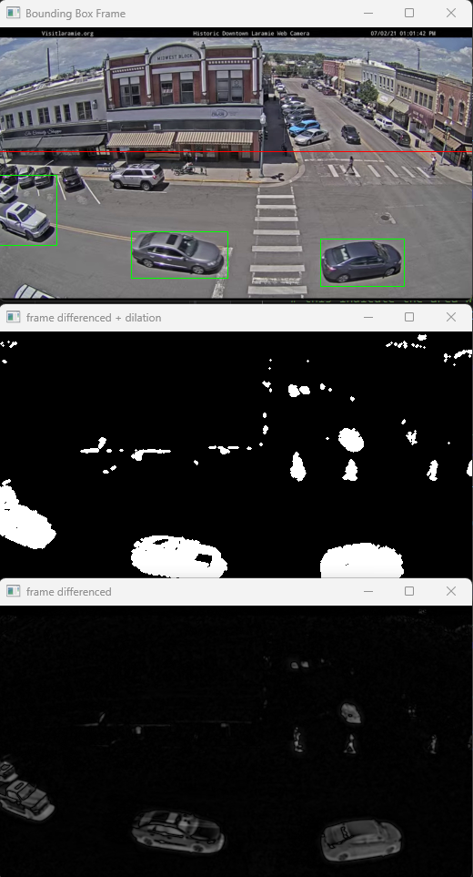
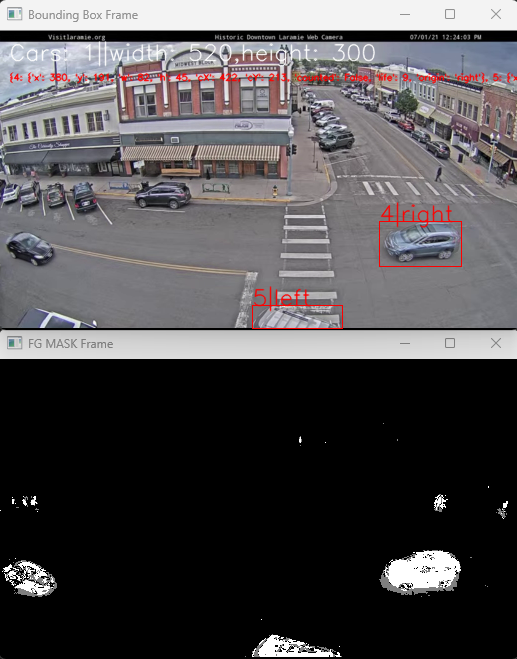

# ISP's Final Exercise1
- OpenCV Car Detection & Tracking Exercise

This repository contains a Python project developed as an exercise for an Intelligent Signal Processing course. It demonstrates car detection, basic tracking, and directional
counting in traffic videos using OpenCV.

The project is implemented in a Jupyter Notebook (exer1_17022025_submission_cleaned.ipynb) and processes two sample video files (Traffic_Laramie_1.mp4 and Traffic_Laramie_2.mp4).

- Key Features & Tasks:
  
  - Task 1: Basic Car Detection
    *Utilises a simple frame differencing technique for background subtraction, using the first frame as a static background.
    
    *Applies image processing steps: grayscale conversion, Gaussian blurring, dilation, and thresholding to isolate foreground objects.
    
    *Detects contours and filters them based on area and location within a defined Region of Interest (ROI) to identify potential cars.
    
    *Visualises detected cars by drawing bounding boxes around them in the output video stream.

    

    [Exercise 1 Output Example]

  - Task 2: Advanced Car Detection, Tracking & Counting

    *Employs the more robust cv.createBackgroundSubtractorMOG2 for dynamic background subtraction.

    *Implements basic car tracking by:

      + Calculating centroids of detected contours.

      + Associating new detections with existing tracked cars based on centroid proximity.

      + Assigning a "life" to each tracked car, removing it if not detected for several frames.

    *Determines the origin (e.g., left, top, right, bottom) of cars entering the ROI.

    *Specifically counts cars moving in a predefined direction (e.g., "left" towards the city center).

    *Provides an estimate of "cars per minute" detected.

    *Displays tracked cars with their ID, origin, and bounding boxes.

    

    [Exercise 2 Output Example]

- Technologies Used:

    *Python 3

    *OpenCV (opencv-contrib-python)

    *NumPy

